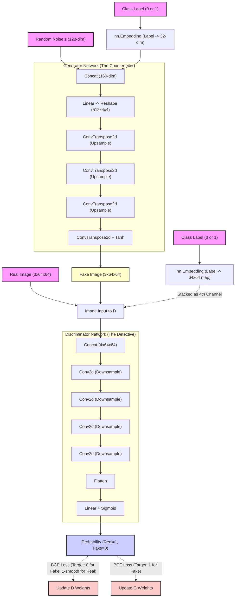

# Conditional GAN Architecture (cGAN)

This diagram visualizes the macro-level architecture of the Conditional Generative Adversarial Network, showing the adversarial minimax game between the Generator and the Discriminator, and how labels are used to condition both networks.

### **Key Viva Takeaways from Architecture**
*   **The Minimax Game**: The Generator is trying to maximize the Discriminator's error (make the probability closer to 1 for fakes), while the Discriminator is trying to minimize it (make the probability 0 for fakes and ~1 for reals).
*   **Conditioning differences**: 
    *   In the **Generator**, the class label is simply concatenated to the flat 1D noise vector `z`.
    *   In the **Discriminator**, the class label is embedded into a massive 2D spatial map (`64x64`) and glued underneath the spatial image as a 4th channel. This forces the Discriminator to look at the pixels *in context* of the requested label.
*   **Label Smoothing**: Notice the target for Real images is "1-smooth" (e.g., 0.9). This prevents the Discriminator from becoming overconfident and killing the gradients.
