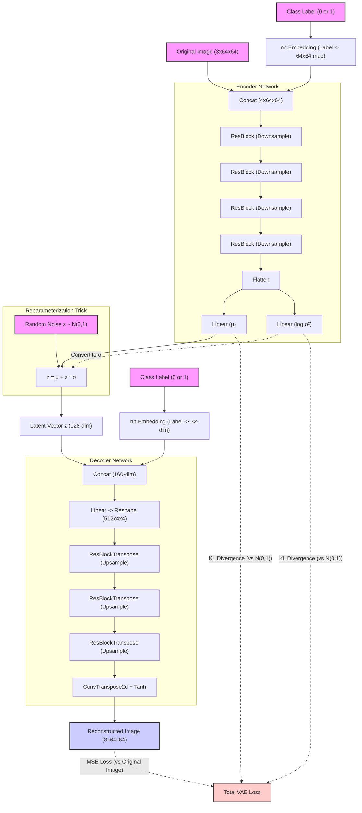

# Conditional VAE Architecture (CVAE)

This diagram visualizes the macro-level architecture of the Conditional Variational Autoencoder, showing how the image and label are processed to create a latent space, and how that latent space is decoded back into an image.

### **Key Viva Takeaways from Architecture**
*   **The Bottleneck**: The entire image is compressed into just two vectors: Mean (μ) and Log-Variance (log(σ²)). This is the core of the Variational Autoencoder.
*   **Reparameterization**: The random noise ε is essential. It allows the network to sample a diverse point `z` from the learned distribution while still allowing backpropagation to push gradients back through μ and log(σ²).
*   **Conditioning (Labels)**: Notice how the class label is injected *twice*. It's given to the Encoder (so it learns separate distributions for glasses vs. no glasses) and the Decoder (so it knows which distribution to generate from).
*   **The Loss Tug-of-War**: The total loss explicitly tries to balance making the generated image match the original (MSE) while forcing $\mu$ and $\log\sigma^2$ to look like a standard normal distribution (KL).
