# DDPM Macro Architecture (Forward & Reverse)

This diagram visualizes the macro-level process of a Denoising Diffusion Probabilistic Model, highlighting the difference between the fixed mathematical forward process and the learned neural network reverse process.

```mermaid
flowchart TD
    %% Forward Process
    subgraph Forward ["Forward Process (Adding Noise) - Fixed Math, NO Traning"]
        direction LR
        X0["Original Face x_0"] -->|"+ tiny noise (β_1)"| X1["x_1"]
        X1 -.-> |"... adding more noise over t steps ..."| Xt_1["x_{t-1}"]
        Xt_1 -->|"+ noise (β_t)"| Xt_Forward["x_t"]
        Xt_Forward -.-> |"... until T=1000 ..."| XT_Forward["Pure Noise x_T ~ N(0,1)"]
    end
    
    %% The Math Shortcut
    X0 -.-> |"q_sample (Direct jump using α_t)"| Xt_Forward
    
    %% Divider
    Divider[================================================================]
    style Divider fill:none,stroke:none,color:transparent
    
    %% Reverse Process
    subgraph Reverse ["Reverse Process (Denoising) - Learned Neural Network"]
        direction RL
        XT_Reverse["Pure Noise x_T ~ N(0,1)"] --> |"Predict noise using UNet"| Xt_Reverse["x_t"]
        Xt_Reverse -.-> |"... denoising step by step ..."| X1_Reverse["x_1"]
        X1_Reverse --> |"Predict noise using UNet"| X0_Reverse["Generated Face x_0"]
        
        %% Unet Detail
        UNet[("Conditional UNet \n(See unet_architecture.md)")]
        Xt_Reverse -.-> |"Pass to"| UNet
        T_Rev["Timestep t"] --> UNet
        L_Rev["Class Label"] --> UNet
        UNet -.-> |"Predicts exactly what noise was added"| NoisePred["Predicted Noise ε_θ"]
        NoisePred -.-> |"Subtract from x_t"| Xt_Reverse
    end
    
    %% Training Loop
    subgraph Training ["Training Loop (Loss Calculation)"]
        direction TB
        Sample["Sample random timestep t"] --> GetTruth["Get true noise ε ~ N(0,1)"]
        GetTruth --> Mix["Mix x_0 and ε (Forward) to get x_t"]
        Mix --> Pred["Pass x_t, t, label to UNet"]
        Pred --> Compare["Calculate MSE Loss"]
        
        Compare -.-> |"Minimize difference"| UNetWeights["Update UNet Weights"]
        
        TrueN["True ε"] --> Compare
        PredN["Predicted ε_θ"] --> Compare
    end

    %% Styling
    classDef fix_math fill:#eef,stroke:#333,stroke-width:2px,stroke-dasharray: 5, 5;
    classDef learn_net fill:#fcc,stroke:#333,stroke-width:2px;
    classDef data fill:#f9f,stroke:#333,stroke-width:2px;
    
    class X0,X1,Xt_1,Xt_Forward,XT_Forward fix_math;
    class XT_Reverse,Xt_Reverse,X1_Reverse,X0_Reverse data;
    class UNet learn_net;
```

### **Key Viva Takeaways from Macro Architecture**
*   **Forward Phase = Just Math**: There are zero neural network weights in the forward phase. It is a strict mathematical formula defined by the Beta (β) schedule that iteratively degrades the image.
*   **The Shortcut (`q_sample`)**: During training, we don't actually loop 500 times to get to timestep 500. We mathematically jump straight from `x_0` to `x_t` in one step by multiplying the original image by cumulative alphas (α) and adding noise.
*   **The Loss is Simple**: The "Denoising" sounds complex, but the loss is just MSE (Mean Squared Error). The UNet looks at `x_t` and guesses the noise ε. We compare it to the *actual* noise we injected.
*   **Reverse Phase = Iterative Neural Network**: To generate an image, we start at pure static (`x_1000`) and have to pass the image through the UNet **1000 separate times**, subtracting a tiny fraction of predicted noise each time until a face appears. This is why generation is remarkably slow but produces incredibly high-quality images.
