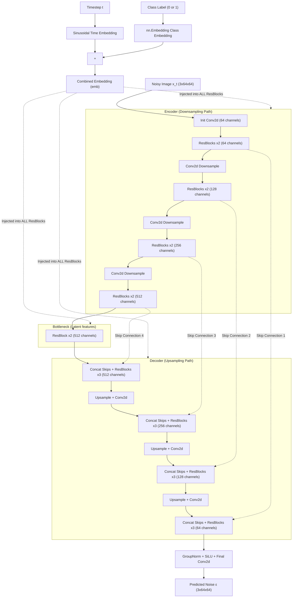

# Conditional UNet Architecture (DDPM)

This diagram visualizes exactly how the noise prediction network takes an image $x_t$, the current timestep $t$, and the class label, and processes them through symmetric Encoder and Decoder paths equipped with ResBlocks and Skip Connections.

### **Key Viva Takeaways from Architecture**
*   **The "U" Shape**: Notice how the image gets squeezed from `64x64` to smaller grids (with increasingly huge channel depths like 512) in the Encoder, then scales back up in the Decoder.
*   **Skip Connections (The Dotted Lines)**: If you compress a face all the way down to a tiny feature map, you lose the high-frequency pixel details (like eyelashes or hair strands). By copying the feature maps from the Encoder and directly concatenating them to the Decoder at the exact same size layer, the Decoder can rebuild the image flawlessly without guessing what the tiny details originally looked like.
*   **The Embedding Injection**: In standard networks, you input data at the top and wait. In a Diffusion UNet, the combined Timestep + Class Label embedding is broadcast and mathematically added directly into the middle of *every single ResBlock* throughout the entire network. This guarantees that whether it is analyzing tiny low-level pixels (Encoder start) or broad high-level features (Bottleneck), the network never forgets what timestep it is predicting noise for.
